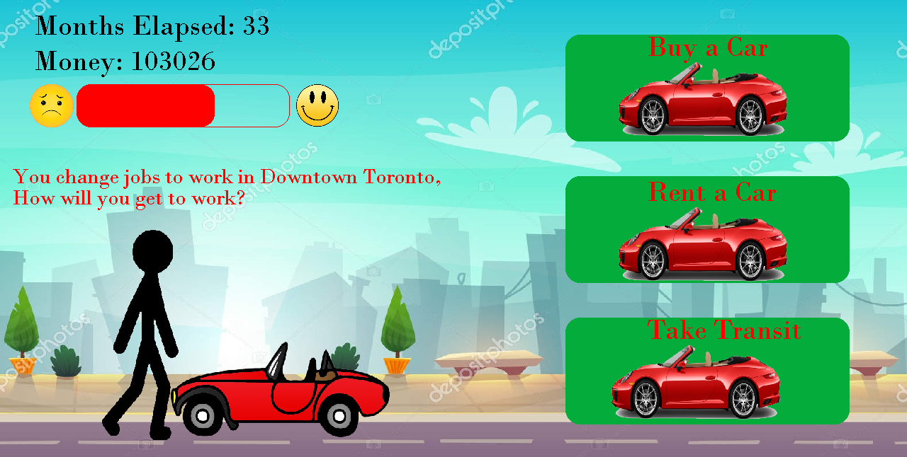

# Financial-Simulator
Financial Simulator for Personal Finances
The Simulator was made for a High School Hackathon at McMaster University. The simulation starts by providing the user 
with a random salary that will raise as time elapses. The user is then prompted to make varying finanicial decisions that 
are the most beneficial for their individual financial situation, and will help educate the player on how to make sound 
financial decisions. 
Here is a screenshot of what it would look like when the user must make a decision. 

As time elapses, your player "walks" through life and they age progressively. Every month they are payed a monthly salary in green and they must pay monthly expenses in red. This includes insurance, taxes, and miscellaneous expenses. Here is a GIF of what it looks like all together.

